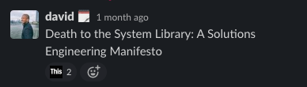

# agenda

- what is a project?
- what makes a project an R project?
- what does `{renv}` do?
- what does RSPM do?
- how do `{renv}` and RSPM work together?
- q&a

# what is a project?

<aside class="notes">
- we're increasing the diversity of things R can do and where it does them
- behooves us to learn from other language and framework paradigms and how they think about reliably delivering product
- 12 factor is focused on deploying web applications but many lessons translate
</aside>

## 12 factor 

> A twelve-factor app never relies on implicit existence of system-wide packages.   

> It declares all dependencies, completely and exactly, via a dependency declaration manifest.  

> Furthermore, it uses a dependency isolation tool during execution to ensure that no implicit dependencies “leak in” from the surrounding system.

<aside class="notes">
- isolation
- enumeration
</aside>

## 12 factor, continued

>  No matter what the toolchain, dependency declaration and isolation must always be used together – only one or the other is not sufficient to satisfy twelve-factor.

## cookiecutter data science

> The first step in reproducing an analysis is always reproducing the computational environment it was run in. You need the same tools, the **same libraries**, and the **same versions** to make everything play nicely together.

<aside class="notes">
reproducibility doesn't have to be binary or all-encompassing
reiterating the previous--an analysis that's only runnable on your machine is not as helpful as one that other people can access
</aside>

## why projects at all?

<aside class="notes">
why is this helpful?
</aside>


> - narrow scope of possible changes to your environments
> - lower collaboration barrier for new team members / future you

# what makes a project an R project?

## `*.Rproj`?

```{r}
readLines("on-projects.Rproj")
```

<aside class="notes">
- `.Rproj` is mostly editor config
- signifier but doesn't accomplish proejct goals
- Some RStudio handling of configurable R behaviors, but R doesn't know that
- You don't ship your editor to your client
</aside>

## `R/`

```{r}
fs::dir_tree("../todo-backend-plumber/", recurse = 1)
```

<aside class="notes">
Serves an API, and in this case having the code at the top level is totally adequate 
</aside>

## `DESCRIPTION`

```{r}
readLines("../urbanindex/DESCRIPTION")
```


<aside class="notes">
- data package only requires min R version, but gives no insight into build
- packages are the right abstraction for redistributing R functions, but many projects are not R packages and trying to force them into that mold can be awkward and unsatisfying

</aside>

# `{renv}`

<aside class="notes">
we should think of renv as the R project primitive
</aside>

## workflow

- `renv::init()`
- `install.packages()`
- `renv::snapshot()`
- `renv::restore()`

## demo

# RSPM



## what does RSPM do?

Gets the system library off your computer

## why did we have a system library?

> - because installing all the R packages your users need is time consuming
> - because some packages require systems administration expertise or privileges that data scientists might not have
> - because you're concerned about giving users the ability to install things on the fly
> - to distribute internal packages without user action  

<br>

> - because we needed an opportunity to review packages before mak ing them available
> - because you have strong regulatory / legal reproducibility requirements

## demo

# `{renv}` + RSPM

## 

- isolate
- enumerate
- regulate

# questions


# resources

- [12factor.net](https://12factor.net/)
- [cookiecutter data science](https://drivendata.github.io/cookiecutter-data-science/)
- [Reproducible Environments](https://environments.rstudio.com/)
- [Reproducible Research Cran Task View](https://cran.r-project.org/web/views/ReproducibleResearch.html)
- [renv](https://rstudio.github.io/renv/articles/renv.html)
- [Stop the Working Directory Insanity](https://gist.github.com/jennybc/362f52446fe1ebc4c49f)
- [Time TravelR](https://www.rstudio.com/resources/webinars/time-travel-r/)
- [Managing Packages for Open Source Data Sciences](https://www.rstudio.com/resources/webinars/managing-packages-for-open-source-data-science/)

# bonus

## the officeverse

Use [{officer}](https://ardata-fr.github.io/officeverse/office-documents-generation.html#templates) to render RMarkdown documents in your corporate style 


